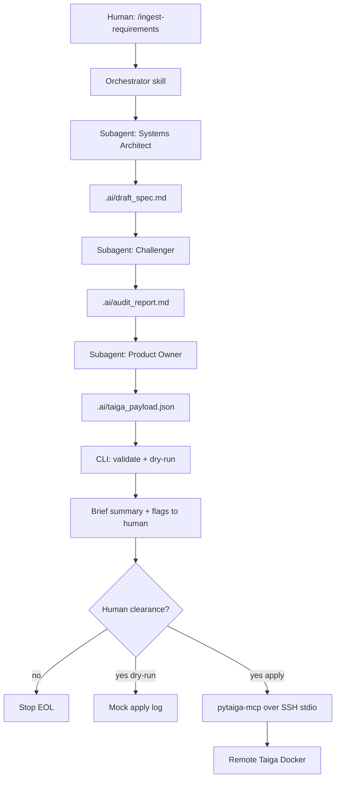

# Taiga Ingest Pipeline Implementation Plan

## Goal

Ship a **Project Management ingest workflow** (scope A): human pastes unstructured notes → local agents auto-chain three passes → dry-run review → human clears → tickets created in remote Taiga Docker via MCP. “Work On Tickets” / Verification Agent are out of scope.

## Architecture




**Automation rule:** After the initial `/ingest-requirements` kickoff, Passes 1→2→3 run **without further human input**. Only the final MCP write step waits for clearance. Each pass has a clear EOL (read file → write file → return).

**MCP choice:** [tetra-2023/pytaiga-mcp](https://github.com/TETRA-2023/pytaiga-mcp) in `workflow` mode (`create_epic`, `create_story`, `break_down_story`, `plan_sprint`, `move_to_sprint`, `add_comment`). Aligns with Epic → Story → Task + sprint assignment.

## Repo layout (greenfield)


| Path                                                                                         | Role                                                                                                           |
| -------------------------------------------------------------------------------------------- | -------------------------------------------------------------------------------------------------------------- |
| `[.cursor/skills/ingest-requirements/SKILL.md](.cursor/skills/ingest-requirements/SKILL.md)` | Orchestrator: kickoff, spawn subagents, human gate, MCP apply                                                  |
| `[.cursor/skills/taiga-architect/SKILL.md](.cursor/skills/taiga-architect/SKILL.md)`         | Pass 1 persona + output contract                                                                               |
| `[.cursor/skills/taiga-challenger/SKILL.md](.cursor/skills/taiga-challenger/SKILL.md)`       | Pass 2 audit + confidence score                                                                                |
| `[.cursor/skills/taiga-product-owner/SKILL.md](.cursor/skills/taiga-product-owner/SKILL.md)` | Pass 3 hierarchy → payload                                                                                     |
| `[.cursor/rules/taiga-ingest.mdc](.cursor/rules/taiga-ingest.mdc)`                           | Hard constraints: manual trigger only, no infinite loops, dry-run before writes, `[HUMAN REVIEW NEEDED]` rules |
| `[schemas/taiga_payload.schema.json](schemas/taiga_payload.schema.json)`                     | JSON Schema for PO output                                                                                      |
| `[tools/taiga_ingest/](tools/taiga_ingest/)`                                                 | Python CLI: `validate`, `dry-run`, optional `apply` helper                                                     |
| `[tests/](tests/)`                                                                           | Schema + dry-run unit tests (no live Taiga required)                                                           |
| `[docs/setup/](docs/setup/)`                                                                 | Manual VPS/Taiga/MCP/SSH/Caddy/UFW runbook                                                                     |
| `[.ai/](.ai/)`                                                                               | Runtime artifacts (gitignored contents, keep `.gitkeep`)                                                       |
| `[.mcp.json.example](.mcp.json.example)`                                                     | SSH-stdio MCP config template                                                                                  |


## Pass contracts

**Pass 1 — Architect** writes `.ai/draft_spec.md`: domain boundaries, implicit requirements, dependencies, I/O/schema notes. Persona from `[.plan/agent-roles.md](.plan/agent-roles.md)`.

**Pass 2 — Challenger** reads draft, writes `.ai/audit_report.md` with findings + `confidence_score` (0.0–1.0). If score < 0.8, inject `[HUMAN REVIEW NEEDED]` into the audit (and PO must propagate ALL-CAPS warning into every affected ticket description).

**Pass 3 — Product Owner** reads draft + audit, writes `.ai/taiga_payload.json` matching schema:

```json
{
  "project_slug": "string",
  "velocity": { "sprint_capacity_points": 0, "notes": "string" },
  "sprints": [{ "name": "string", "estimated_start": "YYYY-MM-DD", "estimated_finish": "YYYY-MM-DD" }],
  "epics": [{
    "temp_id": "E1",
    "subject": "string",
    "description": "string",
    "stories": [{
      "temp_id": "US1",
      "subject": "As a... I want... So that...",
      "description": "markdown + AC checkboxes",
      "needs_human_review": false,
      "points": 0,
      "sprint_name": "string|null",
      "tasks": [{ "temp_id": "T1", "subject": "string", "description": "string" }]
    }]
  }],
  "warnings": ["string"],
  "summary": "brief human-facing summary"
}
```

Hierarchy rules: **Epic** = theme; **User Story** = As a… + AC checkboxes; **Task** = code/file-level work. Oversized stories flagged for breakdown in `warnings`.

## Orchestrator behavior (Cursor)

1. Human runs ingest with raw notes (and optional `project_slug`, velocity, `--dry-run`).
2. Parent agent **must** Task/subagent Pass 1 → wait → Pass 2 → wait → Pass 3 (file handoffs; no skipping).
3. Run `python -m tools.taiga_ingest validate .ai/taiga_payload.json`.
4. Print brief summary + confidence/flags; **pause**.
5. On clearance:
  - `--dry-run` / default until explicit apply: emit ordered MCP call plan to `.ai/dry_run_plan.md` (no network).
  - Explicit “apply to Taiga”: call MCP tools in order: sprints → epics → stories (link epic, optional sprint) → tasks via `break_down_story` / `create_task` → write `.ai/apply_result.json` with created refs.
6. Stop. Finite EOL always.

Token control: summary-before-write gate; rule to refuse apply if payload invalid; prefer `verbosity: minimal` on MCP reads.

## Local lightweight testing

No local Taiga required for day-to-day debug:

1. **Schema tests** — fixture payloads (valid, low-confidence, missing AC) against JSON Schema.
2. **Dry-run planner tests** — assert ordered mock MCP ops from a fixture payload (deterministic, no SSH).
3. **Golden fixture** — sample Discord dump → expected artifact shapes (docs + optional prompt eval notes).
4. **Optional live smoke** (documented, not default CI): local MCP pointing at remote/staging Taiga with a throwaway project.

CLI:

```bash
python -m tools.taiga_ingest validate .ai/taiga_payload.json
python -m tools.taiga_ingest dry-run .ai/taiga_payload.json -o .ai/dry_run_plan.md
```

## Manual setup (documented in detail)

`docs/setup/` will cover, step-by-step with copy-paste commands:

1. **VPS bootstrap** — Docker, UFW (22/80/443), deploy user, Ed25519 SSH hardening (`[.plan/security-recommendations.md](.plan/security-recommendations.md)`).
2. **Taiga Docker** — clone `taigaio/taiga-docker` stable, configure `.env`, bring up stack, create project + bot user.
3. **Caddy** — `taiga.yourdomain.com` → `localhost:9000`, auto-TLS (or caddy-docker-proxy labels).
4. **pytaiga-mcp container** — same Docker network as Taiga API; env `TAIGA_API_URL`, credentials; **stdio only** (not published to internet).
5. **Local Cursor MCP** — `.mcp.json` SSH wrapper: `ssh -i … -T deploy@vps 'docker exec -i taiga-mcp …'`.
6. **Repo clone + skills** — copy example MCP config, set `project_slug`, first dry-run ingest.
7. **Backups** — Postgres volume dump cron (script + restore notes).

Future RAG/vector stores: keep `.ai/` + `schemas/` as the structured handoff layer so retrieval can feed Pass 1 later without rewriting MCP apply.

## Global constraints (from specs)

- Manually triggered; finite EOL; never autonomous/indefinite.
- Vague input → flag in agent output **and** ALL-CAPS human-review warning in ticket details.
- MCP over SSH stdio preferred; no exposed MCP HTTP on the VPS.
- Portable Cursor skills/rules as primary LAT artifacts.

## Implementation sequence

1. Scaffold repo (gitignore, README, `.ai/`, schemas, Python package skeleton).
2. JSON Schema + validate/dry-run CLI + unit tests.
3. Four skills + ingest rule (orchestrator enforces automated subagent chain).
4. MCP example config + apply-order docs mapped to pytaiga-mcp workflow tools.
5. Full `docs/setup/` runbook (VPS → Taiga → Caddy → MCP → local Cursor).
6. End-to-end dry-run walkthrough with a sample notes fixture.

## Explicitly deferred

- Work-on-tickets use case and Verification Agent.
- Local full Taiga Docker for default tests.
- RAG / vector stores.
- Custom apply script that bypasses MCP (agents use MCP after gate; CLI only validates/plans).

